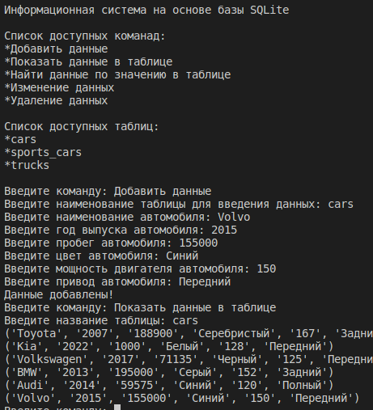
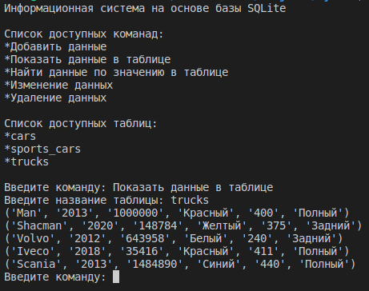
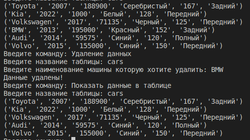

# Информационная система на основе SQLite#

### Основные задачи данной базы данных: 

* Хранение данных 
   * Создается локальный файл с данными new db, где хранятся все данные
* Запись данных
  * 
* Воспроизведение данных
  * 
* Изменение данных
 * 
* Удаление данных
 * 

### Все данные хранятся в трех таблицах: 

* cars
* sports_cars
* trucks

## Модули программы 

### Main
Модуль запуска приложения

### Database
Модуль взаимодействия с базой данных, выполнение операций по записи, изменению, удалению, воспроизведению, удалению данных.

### Model
Модуль взаимодействия между пользователем через консоль и базой данных.

