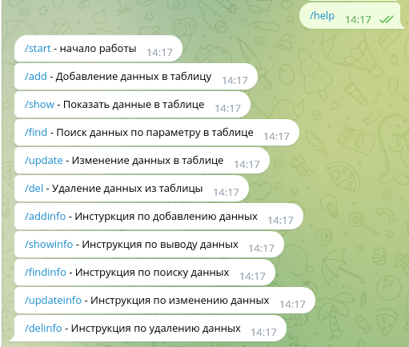

# Телеграм бот с базой данных

В данный бот дает возможность работать с базой данных sqlite3. Возможность записывать, изменять, удалять, находить данные по параметру.
Программа состоит из следующих модулей:
* telBot
* database

## Модуль telBot
Предназначен для взаимодействия с интерфейсом телеграм бота и взаимодействует с модулем database.

## Модуль database
Предназначен для взаимодействия с базой данных.

  **_Для корректной работы бота необходиом получить token для бота_**

  Доступные команды:
  * /start
  * 
  * /add
  * 
  * /show
  * 
  * /find
  * 
  * /update
  *  
  * /del
  *  
  * /help
  