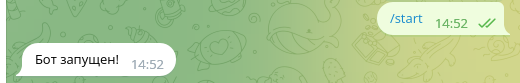

# Телеграм бот с функционалом

В данный бот заложены функции вычисления числовых выражений и перевода слов с английского на русский.
Программа состоит из следующих модулей:
* telBot
* model
* logger

## Модуль telBot
Предназначен для взаимодействия с интерфейсом телеграм бота и взаимодействует с модулями model, logger.

## Модуль model
Предназначен для произведения вычислений.

## Модуль logger
Предназначен для создания логов, вывода логов. Создает файл log.csv, где ханит список всех команд отправленных через строку ввода в телеграм боте.

  **_Для корректной работы бота необходиом получить token для бота и token для сайта lingvolive.com._**

  Доступные команды:
  * /start
  
  * /calc
  
  * /translate
  
  * /log
  
  * /help
  